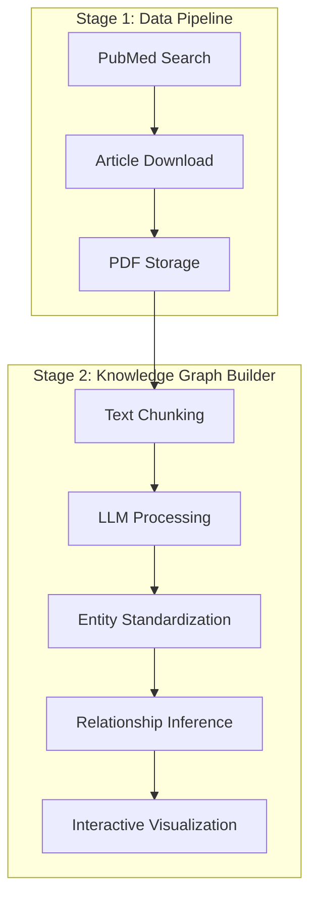

# LLM Knowledge Graph Builder

An AI-powered system that automatically extracts structured knowledge graphs from scientific literature by combining PubMed data retrieval with Large Language Model processing to create interactive visualizations of entity relationships.

## Features

- **Automated Literature Retrieval**: Searches and downloads scientific articles from PubMed based on user queries [1](#0-0) 
- **LLM-Powered Knowledge Extraction**: Uses configurable LLMs to extract Subject-Predicate-Object triples from text [2](#0-1) 
- **Entity Standardization**: Ensures consistent entity naming across document chunks [3](#0-2) 
- **Relationship Inference**: Discovers additional relationships between disconnected graph components [4](#0-3) 
- **Interactive Visualization**: Generates web-based knowledge graphs with zoom, pan, and hover capabilities
- **Multi-Provider LLM Support**: Compatible with OpenAI, Ollama, and any OpenAI-compatible API endpoints

## Requirements

- Python 3.11+
- PubMed API access (ENTREZ_EMAIL required)
- LLM API access (OpenAI, Ollama, or compatible endpoint)

## Installation

1. Clone the repository:
```bash
git clone https://github.com/koolgax99/llm-knowledge-graph-builder.git
cd llm-knowledge-graph-builder
```

2. Install dependencies:
```bash
pip install -r requirements.txt
```

3. Set up environment variables:
```bash
# Create .env file with:
ENTREZ_EMAIL=your.email@example.com
PUBMED_API_KEY=your_pubmed_api_key  # Optional but recommended
```

4. Configure LLM settings in `config.toml`:
```toml
[llm]
model = "gpt-3.5-turbo"
api_key = "your-api-key"
base_url = "https://api.openai.com/v1/chat/completions"
max_tokens = 8192
temperature = 0.2
```

## Quick Start

Run the complete pipeline with a single command: [5](#0-4) 

```bash
python src/main.py --query "machine learning in healthcare" --output_folder ./output --max_results 20
```

This will:
1. Search PubMed for relevant articles
2. Download and process the papers
3. Extract knowledge graphs using LLM analysis
4. Generate interactive HTML visualizations

## System Architecture

The system implements a two-stage pipeline architecture: [6](#0-5) 



### Stage 1: Data Pipeline
- Searches PubMed using configurable date ranges and query terms
- Downloads articles and stores metadata in SQLite database
- Exports results to CSV for analysis

### Stage 2: Knowledge Graph Builder
- Processes text through three-phase LLM pipeline
- Extracts Subject-Predicate-Object triples
- Standardizes entities and infers relationships
- Generates interactive HTML visualizations

## Configuration

### Data Pipeline Configuration
Set environment variables in `.env`:
```bash
ENTREZ_EMAIL=your.email@example.com
PUBMED_API_KEY=your_api_key  # Optional
```

### Knowledge Graph Builder Configuration
Configure `config.toml`: [7](#0-6) 

```toml
[llm]
model = "gpt-3.5-turbo"
api_key = "your-api-key"
base_url = "https://api.openai.com/v1/chat/completions"
max_tokens = 8192
temperature = 0.2

[chunking]
chunk_size = 500
overlap = 50

[standardization]
enabled = true

[inference]
enabled = true
```

## Command Line Options

### Main Pipeline
```bash
python src/main.py [OPTIONS]

Options:
  --query TEXT          Search query for PubMed
  --output_folder PATH  Output directory (default: ./data2)
  --config_path PATH    Configuration file path (default: ./config.toml)
```

### Knowledge Graph Builder Only
```bash
python src/knowledge_graph_builder/main.py [OPTIONS]

Options:
  --input PATH          Input folder with text files
  --output PATH         Output directory
  --config PATH         Configuration file
  --debug              Enable debug output
  --no-standardize     Disable entity standardization
  --no-inference       Disable relationship inference
```

## Output Files

The system generates several output formats:

- **CSV Files**: Search results and download logs
- **JSON Files**: Structured triple data for programmatic access
- **HTML Files**: Interactive knowledge graph visualizations
- **SQLite Database**: Article metadata and search history

## How It Works

### Three-Phase Processing Pipeline

1. **Initial Triple Extraction**: [8](#0-7) 
   - Text is chunked with overlap to maintain context
   - Each chunk is processed by LLM to extract SPO triples
   - Results are validated and filtered for completeness

2. **Entity Standardization** (Optional): [3](#0-2) 
   - Consolidates similar entities across chunks
   - Resolves naming variations and synonyms
   - Creates more coherent knowledge representation

3. **Relationship Inference** (Optional): [4](#0-3) 
   - Discovers additional relationships between entities
   - Reduces graph fragmentation
   - Enhances knowledge connectivity

## Project Structure

```
├── src/
│   ├── main.py                     # Main pipeline orchestrator
│   ├── data_pipeline/              # PubMed data retrieval system
│   │   ├── main.py                 # Data pipeline entry point
│   │   ├── pubmed/                 # PubMed API integration
│   │   └── utils/                  # Database and utility functions
│   └── knowledge_graph_builder/    # Knowledge graph construction system
│       ├── main.py                 # Knowledge graph builder entry point
│       ├── llm.py                  # LLM integration and processing
│       ├── visualization.py        # Interactive graph generation
│       ├── entity_standardization.py # Entity processing algorithms
│       └── templates/              # HTML visualization templates
├── config.toml                     # System configuration
└── requirements.txt                # Python dependencies
```

## License

This project is licensed under the MIT License.

## Notes

The system is specifically designed for scientific literature analysis and uses domain-specific prompts for medical and research contexts. The two-stage architecture allows for independent scaling of data acquisition and knowledge processing components. All LLM processing is configurable and supports multiple providers through OpenAI-compatible APIs.

Wiki pages you might want to explore:
- [Overview (koolgax99/llm-knowledge-graph-builder)](/wiki/koolgax99/llm-knowledge-graph-builder#1)
- [System Architecture (koolgax99/llm-knowledge-graph-builder)](/wiki/koolgax99/llm-knowledge-graph-builder#1.2)
- [Knowledge Graph Builder System (koolgax99/llm-knowledge-graph-builder)](/wiki/koolgax99/llm-knowledge-graph-builder#3)